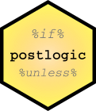

<!-- README.md is generated from README.Rmd. Please edit that file -->
`postlogic` 
======================================================================

[](https://travis-ci.org/RDocTaskForce/postlogic) [](https://codecov.io/github/RDocTaskForce/postlogic?branch=master) [](https://cran.r-project.org/package=postlogic) [](https://www.tidyverse.org/lifecycle/#experimental)

The goal of postlogic is to allow natural flowing logic statements.

Installation
------------

You can install the released version of postlogic from [CRAN](https://CRAN.R-project.org) with:

``` r
install.packages("postlogic")
```

If/Otherwise
------------

The if/otherwise instruction allows for simple logic to follow a statement to make it conditional. The `%if%` can be used alone to make an action conditional.

``` r
verbose <- TRUE 
message("Hello there") %if% verbose
#> Hello there
```

When combined with the `%otherwise%` statement it allows for an alternate.

``` r
mood <- "calm"
message("How dare you!") %if% (mood == 'angry') %otherwise% 
    message("Everything is fine.")
#> Everything is fine.

mood <- 'angry'
message("How dare you!") %if% (mood == 'angry') %otherwise% 
    message("Everything is fine.")
#> How dare you!
```

Unless/Then
-----------

The `%unless%` operator is essentially the negation of `%if%`. So when a statement is postfixed by an `%unless%` statement it will happen unless the proposition returns `TRUE`. The alternating operator for `%unless%` is `%then%`.

``` r
mood <- 'calm'
message("Everything is fine.") %unless% (mood == 'angry') %then% 
    message("How dare you!")
#> Everything is fine.
```

This example is the same effect as the statements in the previous example.

Documentation
-------------

The `postlogic` package is developed by the R Documentation Task Force, an [R Consortium](https://www.r-consortium.org) [Infrastructure Steering Committee working group](https://www.r-consortium.org/projects/isc-working-groups).
